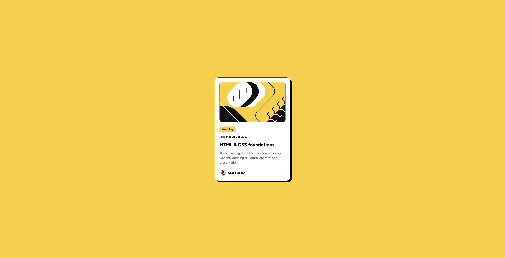
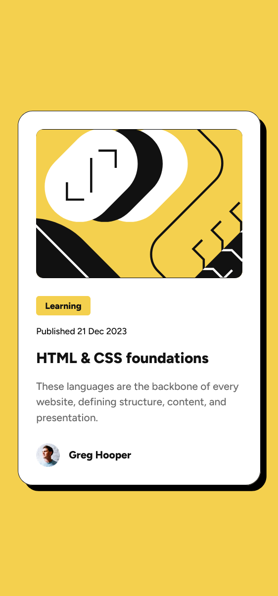

# Frontend Mentor - Blog preview card solution

This is a solution to the [Blog preview card challenge on Frontend Mentor](https://www.frontendmentor.io/challenges/blog-preview-card-ckPaj01IcS). Frontend Mentor challenges help you improve your coding skills by building realistic projects. 

## Table of contents

- [Overview](#overview)
  - [The challenge](#the-challenge)
  - [Screenshot](#screenshot)
  - [Links](#links)
- [My process](#my-process)
  - [Built with](#built-with)
  - [What I learned](#what-i-learned)
  - [Continued development](#continued-development)
  - [Useful resources](#useful-resources)
- [Author](#author)

**Note: Delete this note and update the table of contents based on what sections you keep.**

## Overview

### The challenge

Users should be able to:

- See hover and focus states for all interactive elements on the page

### Screenshot

Desktop             |  Mobile
:------------------:|:-------------------:
  |  

### Links

- Solution URL: [GitHub repo](https://github.com/neo-the-coder/frontendmentor/blog-preview-card-main)
- Live Site URL: [GitHub Page](https://neo-the-coder.github.io/frontendmentor/blog-preview-card-main)

## My process

### Built with

- Semantic HTML5 markup
- CSS custom properties
- Flexbox

### What I learned

I took the challenge to make component responsive by NOT using @media rules, and I discovered CSS clamp() function to help me to achieve that. Sharing example below of usage:

```css
.card-container {
  width: clamp(327px, 19.1831rem + 5.3521vw, 384px);
}
```

As you can see, here we have 3 arguments for clamp function, min value, value in-between and max value.

### Continued development

After a community review, if it is feasable, I want to dive in more into clamp function for future responsive projects. 

### Useful resources

- [CSS Clamping tool](https://clamp.font-size.app/) - This helped me to generate css clamp() values easily. I really liked the simplicity of app and will use it going forward.

## Author

- Frontend Mentor - [@neo-the-coder](https://www.frontendmentor.io/profile/neo-the-coder)
- GitHub - [@neo-the-coder](https://github.com/neo-the-coder)