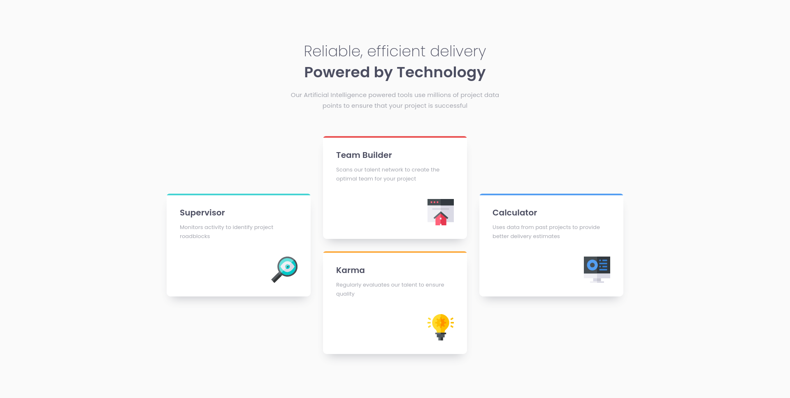
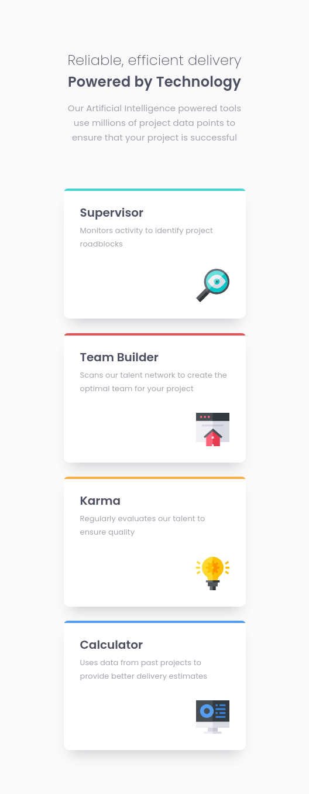

# Frontend Mentor - Four card feature section solution

This is a solution to the [Four card feature section challenge on Frontend Mentor](https://www.frontendmentor.io/challenges/four-card-feature-section-weK1eFYK). Frontend Mentor challenges help you improve your coding skills by building realistic projects. 

## Table of contents

- [Overview](#overview)
  - [The challenge](#the-challenge)
  - [Screenshot](#screenshot)
  - [Links](#links)
- [My process](#my-process)
  - [Built with](#built-with)
- [Author](#author)

## Overview

### The challenge

Users should be able to:

- View the optimal layout for the site depending on their device's screen size

### Screenshot

Desktop             |  Mobile
:------------------:|:-------------------:
  |  

### Links

- [Solution URL](https://github.com/neo-the-coder/frontendmentor/tree/main/four-card-feature-section-master)
- [Live Site URL](https://neo-the-coder.github.io/frontendmentor/four-card-feature-section-master)

## My process

### Built with

- Semantic HTML5 markup
- Less CSS
- BEM naming
- Flexbox
- CSS Grid

## Author

- Frontend Mentor - [@neo-the-coder](https://www.frontendmentor.io/profile/neo-the-coder)
- GitHub - [@neo-the-coder](https://github.com/neo-the-coder)
