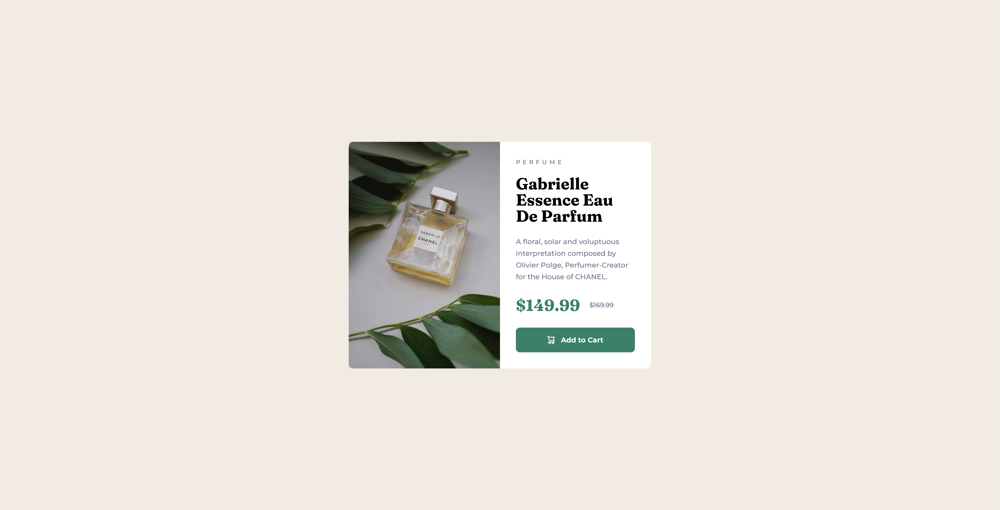
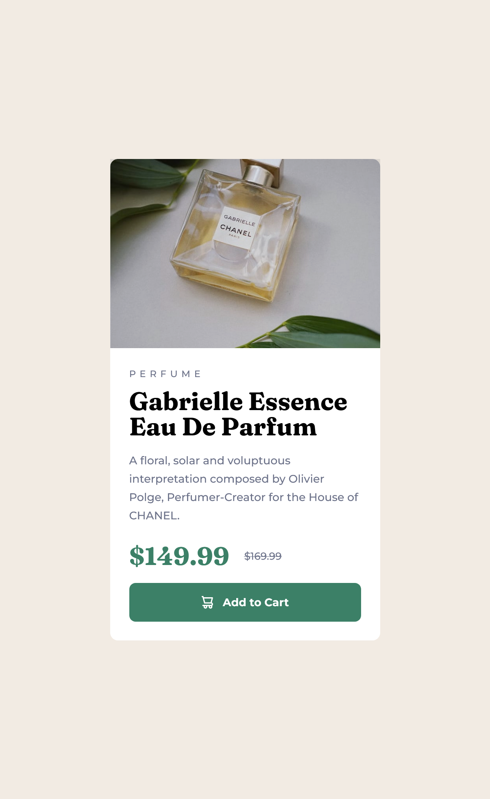

# Frontend Mentor - Product preview card component solution

This is a solution to the [Product preview card component challenge on Frontend Mentor](https://www.frontendmentor.io/challenges/product-preview-card-component-GO7UmttRfa). Frontend Mentor challenges help you improve your coding skills by building realistic projects. 

## Table of contents

- [Overview](#overview)
  - [The challenge](#the-challenge)
  - [Screenshot](#screenshot)
  - [Links](#links)
- [My process](#my-process)
  - [Built with](#built-with)
  - [What I learned](#what-i-learned)
  - [Continued development](#continued-development)
- [Author](#author)
- [Acknowledgments](#acknowledgments)

**Note: Delete this note and update the table of contents based on what sections you keep.**

## Overview

### The challenge

Users should be able to:

- View the optimal layout depending on their device's screen size
- See hover and focus states for interactive elements

### Screenshot

Desktop             |  Mobile
:------------------:|:-------------------:
  |  

### Links

- [Solution URL](https://github.com/neo-the-coder/frontendmentor/tree/main/product-preview-card-component-main)
- [Live Site URL](https://neo-the-coder.github.io/frontendmentor/product-preview-card-component-main)

## My process

### Built with

- Semantic HTML5 markup
- Less CSS
- BEM naming
- Flexbox
- CSS Grid
- Responsive images with srscet/sizes attributes

### What I learned

How to use srcset and sizes attribute in img tag to let browser decide optimal img to download for device.
Use this section to recap over some of your major learnings while working through this project. Writing these out and providing code samples of areas you want to highlight is a great way to reinforce your own knowledge.

To see how you can add code snippets, see below:

```html

```

### Continued development

Going forward I plan to use other techniques for responsiveness other than media at rules, for example picture tag with sources or srcset and sizes attributes for img whenever applicable.

## Author

- Frontend Mentor - [@neo-the-coder](https://www.frontendmentor.io/profile/neo-the-coder)
- GitHub - [@neo-the-coder](https://github.com/neo-the-coder)

## Acknowledgments

Thanks [@bhuvi819381](https://www.frontendmentor.io/profile/bhuvi819381) for recommending browser extension ["Pixel Perfect" by WellDone](https://www.welldonecode.com/perfectpixel/) for matching design and code easily
