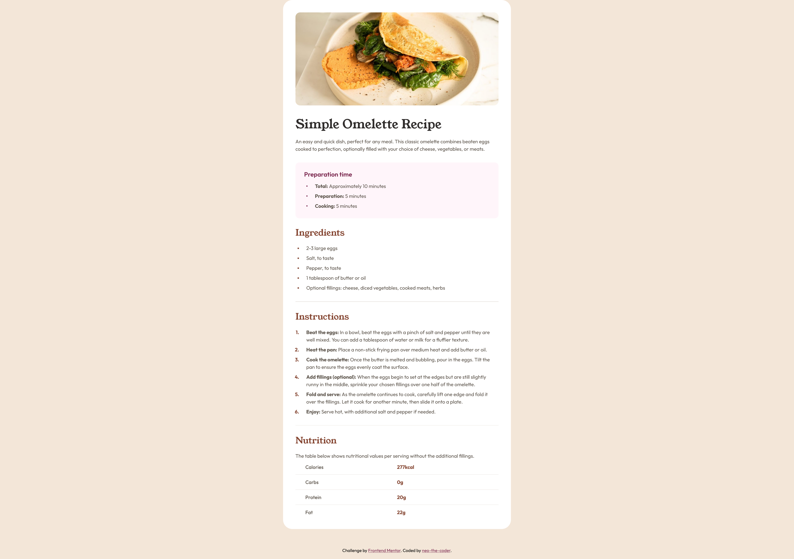
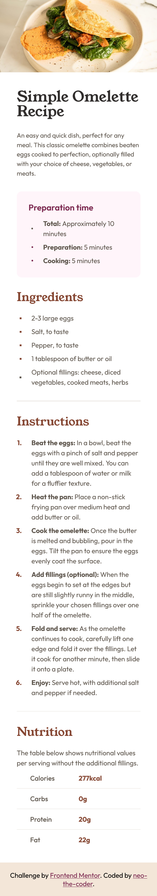

# Frontend Mentor - Recipe page solution

This is a solution to the [Recipe page challenge on Frontend Mentor](https://www.frontendmentor.io/challenges/recipe-page-KiTsR8QQKm). Frontend Mentor challenges help you improve your coding skills by building realistic projects. 

## Table of contents

- [Overview](#overview)
  - [Screenshot](#screenshot)
  - [Links](#links)
- [My process](#my-process)
  - [Built with](#built-with)
  - [What I learned](#what-i-learned)
  - [Useful resources](#useful-resources)
- [Author](#author)

## Overview

### Screenshot

Desktop             |  Mobile
:------------------:|:-------------------:
  |  

### Links

- [Solution URL](https://github.com/neo-the-coder/frontendmentor/tree/main/recipe-page-main)
- [Live Site URL](https://neo-the-coder.github.io/frontendmentor/recipe-page-main)

## My process

### Built with

- Semantic HTML5 markup
- CSS custom properties
- Flexbox

### What I learned

By working out this project, I discovered that list markers are hard to tame with CSS, you can't just set font styles one by one. Thanks to the stack overlow post, I managed to set font style on markers using shorthand property as below:

```html
<li class="list-item">...</li>
```
```css
li.list-item::marker {
  font: 700 16px/150% var(--font-outfit);
  color: var(--color-brown-800);
}
```

### Useful resources

- [The numeric list types don't apply the correct font-family](https://stackoverflow.com/questions/77945209/the-numeric-list-types-dont-apply-the-correct-font-family) - This helped me to set font style on list markers.

## Author

- Frontend Mentor - [@neo-the-coder](https://www.frontendmentor.io/profile/neo-the-coder)
- GitHub - [@neo-the-coder](https://github.com/neo-the-coder)